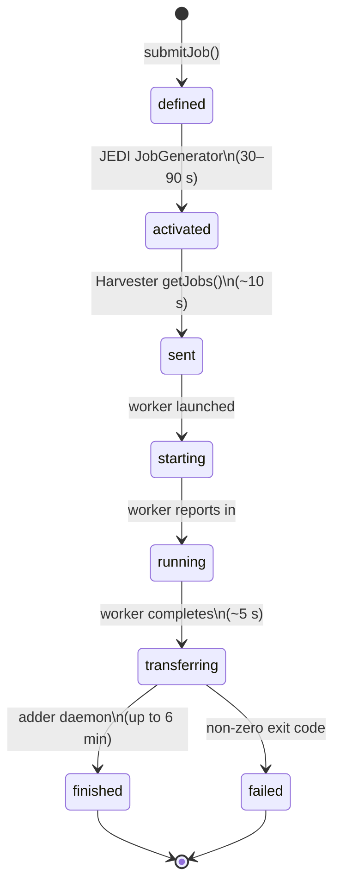

# Job Management

The `scripts/` directory contains three Python wrapper scripts that talk to the PanDA
REST API via [panda-client](https://pypi.org/project/panda-client/).

## Prerequisites

```bash
pip install panda-client
```

Set the following environment variables (the dev-stack defaults are shown):

```bash
export PANDA_URL=http://localhost:25080/server/panda
export PANDA_URL_SSL=http://localhost:25080/server/panda
export X509_USER_PROXY=/dev/null   # suppress grid-proxy noise in dev mode
```

## Submit a job

```bash
JOB_ID=$(python3 scripts/pandajob-submit \
    --site  PANDA_COMPOSE_LOCAL \
    --transformation /bin/echo \
    --params "hello world" \
    --name  my-test-job)
echo "Submitted PanDA job $JOB_ID"
```

On success a single integer job ID is printed to stdout.

### Submit options

| Option | Default | Description |
|---|---|---|
| `--site SITE` | `PANDA_COMPOSE_LOCAL` | PanDA compute site / queue name |
| `--transformation PATH` | — | Binary to execute inside the worker container |
| `--script FILE` | — | Shell script on the **host** filesystem; its content is inlined and run via `sh -c` inside the worker container (must be POSIX `sh`-compatible) |
| `--params STRING` | `""` | Arguments passed to the transformation |
| `--container IMAGE` | *(queue default)* | Docker image for the job worker (e.g. `python:3.12-alpine`) |
| `--name NAME` | `panda-compose-job` | Human-readable job label |
| `--cores N` | `1` | CPU cores requested |
| `--memory MB` | `2000` | Memory in MB |
| `--walltime S` | `3600` | Wall-clock limit in seconds |

> **Script execution:** `--script FILE` reads the file from the host and passes
> its content as `sh -c '<content>'` inside the worker container.  No volume
> mount is required; the script works with any container image that has `sh`.
> Use `--container IMAGE` to select the image (default: `alpine:latest`).
> Scripts must be POSIX `sh`-compatible — bash-specific features (arrays,
> `[[`, `(( ))`, process substitution) may fail in minimal images.  For
> bash-dependent scripts, use a bash-capable image and run:
> `--transformation bash --params "-c 'your command'"`.
>
> **⚠ Data exposure:** the script content is stored verbatim in the PanDA
> database (`jobparameters` column) and may appear in server or harvester
> logs.  Do not embed credentials, tokens, or other secrets in `--script`
> files.

## Query job status

```bash
python3 scripts/pandajob-status $JOB_ID
```

Prints a JSON object to stdout:

```json
{
  "jobID": 7,
  "jobStatus": "finished",
  "exeErrorCode": 0,
  "exeErrorDiag": "",
  "pilotErrorCode": 0,
  "pilotErrorDiag": "",
  "taskBufferErrorCode": 0,
  "taskBufferErrorDiag": ""
}
```

### Known status values

| Status | Description |
|---|---|
| `defined` | Job received by PanDA server; awaiting JEDI activation |
| `waiting` | Held by JEDI pending resource availability |
| `assigned` | Assigned to a site |
| `activated` | Ready to be picked up by Harvester |
| `sent` | Retrieved by Harvester |
| `starting` | Worker process launched |
| `running` | Worker reported in-progress |
| `merging` | Output merging (not used in this stack) |
| `transferring` | Worker finished; adder daemon processing output |
| `finished` | Job completed successfully ✅ |
| `failed` | Job completed with non-zero exit code ❌ |
| `cancelled` | Job killed by user or system |

## Cancel a job

```bash
python3 scripts/pandajob-kill $JOB_ID
```

Exits 0 even if the job is already in a terminal state.

## Job lifecycle timing

A typical job submitted with `/bin/echo` or `/bin/true` follows this state progression:



Total end-to-end: **2–8 minutes**. The adder daemon loop that transitions jobs from
`transferring` to `finished` runs every ~6 minutes, which is the dominant factor in
total job time.

## Polling pattern

```bash
TIMEOUT=600   # 10 minutes
DEADLINE=$((SECONDS + TIMEOUT))
while [[ $SECONDS -lt $DEADLINE ]]; do
    STATUS=$(python3 scripts/pandajob-status "$JOB_ID" \
        | python3 -c "import sys,json; print(json.load(sys.stdin)['jobStatus'])")
    echo "[$(date -u '+%H:%M:%S')] $STATUS"
    case "$STATUS" in
        finished) echo "Done!"; break ;;
        failed|cancelled) echo "Job ended: $STATUS"; exit 1 ;;
    esac
    sleep 15
done
```
